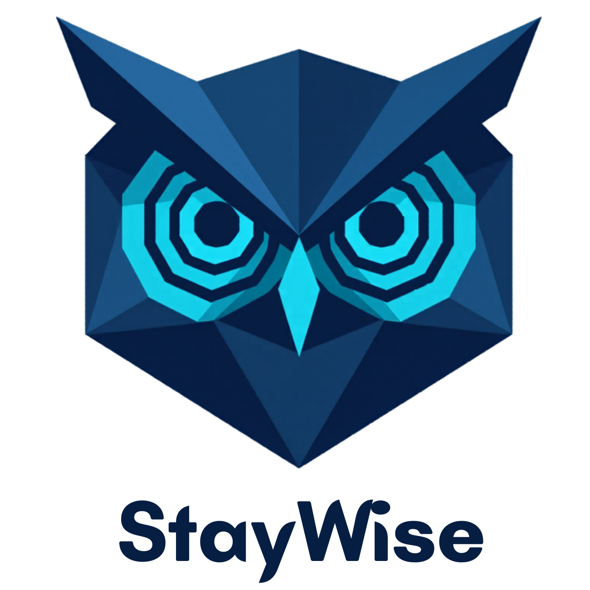

<div align="center">



### E-Commerce Churn Prediction & Retention Analytics Platform

*End-to-end MLOps platform that transforms raw e-commerce transactions into AI-powered churn predictions and actionable retention insights.*

[](https://python.org)
[](https://fastapi.tiangolo.com)
[](https://nextjs.org)
[](https://postgresql.org)
[](https://airflow.apache.org)
[](https://mlflow.org)
[](https://docker.com)
[](LICENSE)

[Features](#-features) · [Architecture](#-architecture) · [Quick Start](#-quick-start) · [Tech Stack](#-tech-stack) · [Project Structure](#-project-structure) · [Roadmap](#-roadmap)

---

<!-- Replace with actual screenshot once available -->
> 📸 *Dashboard screenshot coming soon*

</div>

---

## 🎯 Overview

StayWise is a production-grade MLOps platform that helps e-commerce businesses identify at-risk customers before they churn and act on it automatically. It covers the full analytics lifecycle, spans from real-time event ingestion and feature engineering to churn scoring, retention recommendations, and AI-powered insights delivery.

Designed for scale, observability, and maintainability with a clean separation between data engineering, machine learning, and product layers.

---

## ✨ Features

### 📊 Analytics Dashboard
- **Executive Summary** — cohort churn rates, revenue at risk, and period-over-period trends at a glance
- **Customer List** — paginated customer table with RFM scores and individual churn risk indicators
- **Geospatial Analysis** — choropleth maps visualizing churn concentration by region
- **Sentiment Analysis** — automated review sentiment pipeline with confidence scores and trend tracking

### 🤖 ML Platform
- **Churn Prediction** — probability-calibrated predictions with confidence intervals per customer
- **RFM Segmentation** — automated customer segmentation into actionable behavioral groups
- **A/B Testing & Uplift Modeling** — measure and compare the effectiveness of retention campaigns
- **Experiment Tracking** — fully reproducible model training with versioned artifacts and metrics

### 🔁 Data Pipeline
- **Real-time Ingestion** — event streaming pipeline for transactional data
- **Automated Orchestration** — scheduled pipelines for feature engineering, churn labeling, and batch scoring
- **Data Warehouse** — star schema with 9+ tables covering facts, dimensions, and aggregates
- **Model Artifact Storage** — versioned model storage with automated backup

### 🧠 AI Analyst
- **Streaming Chatbot** — conversational analytics assistant with real-time streaming responses
- **Structured Outputs** — responses rendered as interactive charts and tables, not just plain text
- **Versioned Prompts** — swap prompt templates without restarting the service
- **Observability** — per-query latency and cost tracking across all AI interactions

---

## 🏗 Architecture

```
┌─────────────────────────────────────────────────────────────────┐
│                        Data Sources                             │
│              E-Commerce Transactions / Events                   │
└────────────────────────────┬────────────────────────────────────┘
                             │
                             ▼
┌─────────────────────────────────────────────────────────────────┐
│                     Kafka (Event Bus)                           │
│              topics: transactions · events                      │
└───────────────┬─────────────────────────┬───────────────────────┘
                │                         │
                ▼                         ▼
┌──────────────────────┐     ┌────────────────────────────────────┐
│   Kafka Consumer     │     │         Apache Airflow             │
│  Raw → PostgreSQL    │     │  rfm_feature_dag                   │
└──────────────────────┘     │  churn_labeling_dag                │
                             │  scoring_dag                       │
                             │  retention_dag                     │
                             └────────────────┬───────────────────┘
                                              │
                             ┌────────────────▼───────────────────┐
                             │     PostgreSQL Data Warehouse       │
                             │   Star Schema · 9+ tables          │
                             │   dim_customers · dim_products      │
                             │   fact_transactions · agg_rfm       │
                             └────────────────┬───────────────────┘
                                              │
                    ┌─────────────────────────┼───────────────────────┐
                    │                         │                       │
                    ▼                         ▼                       ▼
        ┌─────────────────┐     ┌─────────────────────┐   ┌──────────────────┐
        │     MLflow      │     │     FastAPI          │   │    AI Analyst    │
        │  Experiment     │────▶│  REST API · v1       │◀──│  SSE Streaming   │
        │  Tracking +     │     │  + SSE Streaming     │   └──────────────────┘
        │  Model Registry │     └──────────┬──────────┘
        └─────────────────┘                │
                    │                      │   Redis (cache)
                    │                      ▼
                    │         ┌─────────────────────┐
                    └────────▶│     Next.js 14      │
                              │  Dashboard · Charts  │
                              │  TanStack · shadcn   │
                              └─────────────────────┘
```

### ML Pipeline Flow

```
Kafka events
  → workers/kafka_consumer.py       (raw ingest → PostgreSQL)
  → Airflow: rfm_feature_dag        (R/F/M calculation)
  → Airflow: churn_labeling_dag     (binary label generation)
  → MLflow: training run            (model training + experiment tracking)
  → Airflow: scoring_dag            (batch churn scores → DW)
  → FastAPI: /api/v1/churn          (serve predictions)
  → Next.js: Customer List page     (visualize with indicators)
```

---

## 🚀 Quick Start

### Prerequisites

- Docker & Docker Compose v2
- Make
- Python 3.12+ (for local backend dev)
- Node.js 20+ (for local frontend dev)

### 1. Clone & configure

```bash
git clone https://github.com/farhanhl-ds/staywise-churn-platform.git
cd staywise-churn-platform

cp .env.example .env
# Edit .env — fill in DATABASE_URL, JWT_SECRET_KEY, AWS credentials
```

### 2. Start infrastructure

```bash
make dev
```

### 3. Run migrations & seed data

```bash
make migrate
make seed
```

### 4. Start the app

```bash
# Backend (FastAPI on :8000)
make run

# Frontend (Next.js on :3000) — in a new terminal
make frontend-dev
```

### 5. Open the dashboard

```
http://localhost:3000          # Dashboard
http://localhost:8000/docs     # API docs
http://localhost:5000          # MLflow UI
http://localhost:8080          # Airflow UI
```

> **Full production stack:**
> ```bash
> make up    # all services containerized
> make down  # tear down
> ```

---

## 🛠 Tech Stack

| Layer | Technology | Purpose |
|---|---|---|
| **Backend API** | FastAPI 0.111 + Python 3.12 | REST endpoints + SSE streaming |
| **Database** | PostgreSQL 16 | Star schema data warehouse |
| **Cache** | Redis 7 | Session cache, rate limiting |
| **Message Queue** | Apache Kafka | Real-time event ingestion |
| **Orchestration** | Apache Airflow 2.9 | RFM + churn pipeline DAGs |
| **ML Tracking** | MLflow 2.13 | Experiment tracking + model registry |
| **Model Storage** | AWS S3 | Versioned model artifacts |
| **Frontend** | Next.js 14 (App Router) + TypeScript | Dashboard UI |
| **UI Components** | shadcn/ui + Recharts + TanStack Table | Charts, tables, pagination |
| **AI Analyst** | Ollama | Streaming analytics chatbot |
| **NLP** | IndoBERT | Review sentiment analysis |
| **Containerization** | Docker Compose | VPS + local profiles |
| **ORM** | SQLAlchemy 2.0 (async) | Database access layer |
| **Migrations** | Alembic | Schema version control |
| **Validation** | Pydantic v2 + Zod | API contracts |
| **Auth** | JWT | Token-based authentication |
| **Linting** | Ruff + mypy | Code quality |
| **Testing** | pytest + pytest-asyncio | Unit + integration tests |

---

## 📁 Project Structure

```
staywise-churn-platform/
├── backend/                    # FastAPI application
│   ├── api/v1/                 # Route handlers (no business logic)
│   │   ├── customers.py        # Customer list + RFM scores
│   │   ├── churn.py            # Churn predictions
│   │   ├── rfm.py              # RFM segmentation
│   │   ├── retention.py        # Retention actions
│   │   ├── sentiment.py        # Sentiment analysis
│   │   └── analyst.py          # AI Analyst SSE streaming
│   ├── core/                   # Config, auth, DI
│   ├── models/                 # SQLAlchemy ORM models
│   ├── schemas/                # Pydantic request/response contracts
│   ├── services/               # All business logic
│   ├── workers/                # Async background jobs
│   └── db/                     # Session, base, Alembic migrations
│
├── ml/                         # ML platform
│   ├── training/               # Feature engineering, labeling, training
│   ├── models/                 # Versioned model artifacts
│   ├── evaluation/             # Golden dataset + offline eval pipeline
│   └── prompts/                # Versioned AI Analyst prompt templates
│
├── pipelines/                  # Apache Airflow
│   └── dags/                   # rfm_feature, churn_labeling, scoring, retention
│
├── observability/              # Tracing, feedback, cost tracking
├── frontend/                   # Next.js 14 dashboard
│   └── app/(dashboard)/        # Executive Summary, Customers, Sentiment,
│                               # Retention, AI Analyst, A/B Testing
│
├── docker/                     # Docker Compose configs
│   ├── docker-compose.yml      # Full production stack
│   └── docker-compose.dev.yml  # Infrastructure only
│
├── scripts/                    # seed.py, migrate.py, backup.sh
├── tests/                      # unit/ + integration/
├── docs/                       # architecture.md, api-reference.md, self-hosting.md
├── .claude/rules/              # AI coding agent context
├── CLAUDE.md                   # Project memory for Claude Code
├── AGENTS.md                   # Agent behavior rules
└── Makefile                    # dev, up, down, migrate, seed, test, lint, train
```

---

## 📊 Data Warehouse Schema

Star schema with 9+ tables:

```
fact_transactions ──── dim_customers
      │            └── dim_products
      │            └── dim_date
      │            └── dim_geography
      │
agg_rfm_scores ──────── dim_customers
agg_customer_segments ── dim_customers
fact_churn_predictions ── dim_customers
```

---

## 🧪 Running Tests

```bash
make test              # All tests
make test-unit         # Unit tests only
make test-integration  # Integration tests only
make test-cov          # With HTML coverage report
```

---

## 📈 Roadmap

### Phase 1 - Foundation
- [x] Project scaffold + folder structure
- [ ] FastAPI skeleton + DB connection + auth
- [ ] Health check endpoint
- [ ] Alembic migrations + star schema

### Phase 2 - Data Layer
- [ ] Kafka consumer (raw transaction ingestion)
- [ ] Airflow: `rfm_feature_dag`
- [ ] Airflow: `churn_labeling_dag`
- [ ] AWS S3 integration

### Phase 3 - ML Layer
- [ ] Feature engineering pipeline
- [ ] Model training with experiment tracking
- [ ] Model registry + production promotion
- [ ] Airflow: `scoring_dag`

### Phase 4 - API + UI
- [ ] All FastAPI endpoints
- [ ] Next.js dashboard pages
- [ ] AI Analyst with SSE streaming
- [ ] A/B testing + uplift modeling page

### Phase 5 - Production
- [ ] Docker Compose dual profile
- [ ] CI/CD workflows
- [ ] Observability (tracing, cost tracking, feedback)
- [ ] Docs (architecture, API reference, self-hosting guide)

---

## 📄 License

Apache 2.0 © [Farhan](https://github.com/farhanhl-ds)

---

<div align="center">

Built with a passion for turning data into decisions and boosted with lots of ☕.

[⬆ Back to top](#-staywise)

</div>